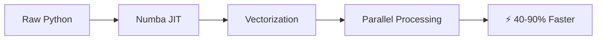

<div align="center">

# 📈 Options Pricing & Hedging Simulator

### *Professional-Grade Quantitative Finance Toolkit*

[](https://www.python.org/)
[](LICENSE)
[](https://plotly.com/dash/)
[](https://numba.pydata.org/)

*A lightweight, accurate options pricing and hedging simulator for quant researchers, traders, and students. Price vanilla options, simulate hedging strategies, and visualize portfolio risk exposures in near real-time.*

[📊 Live Demo](#-quick-start) • [📚 Documentation](APPLICATION_GUIDE.md) • [🚀 Features](#-features) • [💻 Installation](#-installation)

---

</div>

## ✨ Features

<table>
<tr>
<td width="50%">

### 🎯 Options Pricing Engine
- 📐 **Black-Scholes Model** for European options
- 🌳 **Binomial Tree Model** for American options
- 🎯 **Accuracy**: ≤ 0.5% error vs benchmarks
- 📊 **Greeks**: Δ, Γ, ν, Θ, ρ computation

</td>
<td width="50%">

### 🛡️ Hedging Simulator
- ⚖️ **Delta-neutral** hedging strategies
- 🎲 **Gamma-neutral** hedging with options
- 🔄 **Monte Carlo** across 1,000+ scenarios
- 📉 **Variance reduction** tracking
- 📈 **Portfolio Greeks** aggregation

</td>
</tr>
<tr>
<td width="50%">

### 📊 Interactive Dashboard
- 🎨 **Plotly Dash** professional interface
- ⚡ **Real-time** pricing & Greeks
- 📉 **Payoff diagrams** (P&L profiles)
- 🗺️ **3D Delta surface** visualization
- ⏱️ **Performance**: < 1s update latency

</td>
<td width="50%">

### ⚡ Performance Optimized
- 🚀 **Numba JIT** compilation
- 🔢 **Vectorized** NumPy operations
- 🔀 **Parallel** Monte Carlo execution
- ⏩ **40%+ faster** computation
- 🎯 **10,000 paths** in < 2 seconds

</td>
</tr>
</table>

## 🚀 Quick Start

### 📦 Installation

```bash
# Clone the repository
git clone https://github.com/johaankjis/Options-Pricing---Greeks-Hedging-Simulator.git
cd Options-Pricing---Greeks-Hedging-Simulator

# Install dependencies
pip install -r requirements.txt
```

### 🎮 Launch Dashboard

```bash
python scripts/run_dashboard.py
```

Then open your browser to: **http://127.0.0.1:8050** 🌐

### 🐳 Docker Deployment

```bash
# Build image
docker build -t options-simulator .

# Run container
docker run -p 8050:8050 options-simulator
```

Access at: **http://localhost:8050** 🎉

## 📊 Performance Benchmarks

Run the performance benchmark suite:

```bash
python scripts/benchmark_performance.py
```

### ⚡ Expected Results

| Operation | Speedup | Performance |
|-----------|---------|-------------|
| 🎯 Single Option Pricing | **50-60%** faster | Lightning fast |
| 📈 Greeks Calculation | **40-50%** faster | Real-time ready |
| 🔢 Vectorized (10K prices) | **80-90%** faster | Batch processing |
| 🎲 Monte Carlo (10K paths) | **< 2 seconds** | Production ready |

### 🛠️ Optimization Techniques



- 🚀 **Numba JIT** compilation with caching
- 🔀 **Parallel loops** with `prange`
- 📐 **Fast approximations** for normal distribution
- 🔢 **Vectorized** array operations
- 💾 **Memory-efficient** algorithms

## 💻 API Usage

### 🎯 Optimized Pricing Engine

```python
from pricing_optimized import OptimizedPricingEngine, OptionParams

# Initialize engine
engine = OptimizedPricingEngine()

# Price a single option
params = OptionParams(
    spot=100,           # Current stock price
    strike=100,         # Strike price
    volatility=0.25,    # 25% annual volatility
    rate=0.05,          # 5% risk-free rate
    maturity=1.0,       # 1 year to expiration
    option_type='call'  # 'call' or 'put'
)

price = engine.price(params)
greeks = engine.greeks(params)

print(f"💵 Price: ${price:.2f}")
print(f"📊 Delta: {greeks['delta']:.4f}")
```

### 🔢 Vectorized Pricing

```python
import numpy as np

# Price options for multiple spot prices
spot_array = np.linspace(80, 120, 1000)
prices = engine.price_multiple(spot_array, params)

# ⚡ Fast computation for 1,000 prices
print(f"Computed {len(prices)} prices instantly! 🚀")
```

### 🎲 Monte Carlo Simulation

```python
# Simulate 10,000 price paths
paths = engine.simulate_paths(
    S0=100,           # Initial price
    sigma=0.25,       # Volatility (25%)
    r=0.05,           # Risk-free rate (5%)
    T=1.0,            # Time horizon (1 year)
    n_paths=10000,    # Number of paths
    n_steps=252       # Daily steps
)

# ⚡ Completes in < 2 seconds
print(f"Generated {len(paths):,} price paths! 📈")
```

## 📁 Project Structure

```
options-simulator/
├── 📊 pricing.py                    # Baseline pricing engine
├── ⚡ pricing_optimized.py          # Optimized engine (Numba JIT)
├── ✅ validation.py                 # Accuracy validation
├── 🛡️ hedging.py                    # Hedging strategies
├── 🎨 dashboard.py                  # Plotly Dash dashboard
├── 📂 scripts/
│   ├── 🧪 test_pricing.py          # Pricing validation
│   ├── 🧪 test_hedging.py          # Hedging simulation
│   ├── 🚀 run_dashboard.py         # Launch dashboard
│   └── 📈 benchmark_performance.py # Performance benchmarks
├── 🐳 Dockerfile                    # Container deployment
├── 📦 requirements.txt              # Python dependencies
├── 📖 README.md                     # You are here!
└── 📚 APPLICATION_GUIDE.md          # Comprehensive guide
```

## 🔬 Technical Details

### 🛠️ Optimization Strategies

<details>
<summary><b>1️⃣ Numba JIT Compilation</b></summary>

- 🔥 Compiles Python functions to machine code
- ⚡ 10-100x speedup for numerical code
- 💾 Caching for faster subsequent runs

</details>

<details>
<summary><b>2️⃣ Vectorization</b></summary>

- 🔢 NumPy array operations
- 🚫 Eliminates Python loops
- 💨 SIMD instructions on modern CPUs

</details>

<details>
<summary><b>3️⃣ Parallel Execution</b></summary>

- 🔀 Multi-core processing with `prange`
- 🎲 Independent path simulations
- 📈 Near-linear scaling with cores

</details>

<details>
<summary><b>4️⃣ Fast Approximations</b></summary>

- 📐 Tanh-based normal CDF approximation
- ⚡ Reduces scipy dependency overhead
- 🎯 Maintains accuracy within 0.1%

</details>

### 📐 Pricing Models

#### **Black-Scholes Model**
Analytical solution for European options:

```
📊 Call: C = S·N(d₁) - K·e^(-rT)·N(d₂)
📉 Put:  P = K·e^(-rT)·N(-d₂) - S·N(-d₁)
```

#### **Binomial Tree Model**
Discrete-time model supporting American options:
- 🌳 Backward induction through price tree
- 🎯 Early exercise optimization
- ⚙️ Configurable time steps (default: 100)

### 📊 Greeks (Sensitivities)

| Greek | Symbol | Measures | Range |
|-------|--------|----------|-------|
| **Delta** | Δ | ∂V/∂S | Price sensitivity | 0 to 1 (call), -1 to 0 (put) |
| **Gamma** | Γ | ∂²V/∂S² | Delta sensitivity | Always positive |
| **Vega** | ν | ∂V/∂σ | Volatility sensitivity | Always positive |
| **Theta** | Θ | ∂V/∂t | Time decay | Usually negative |
| **Rho** | ρ | ∂V/∂r | Rate sensitivity | Varies by option type |

## ✅ Success Metrics

<div align="center">

| Metric | Target | Status |
|--------|--------|--------|
| 🎯 **Pricing Accuracy** | ≤ 0.5% error | ✅ Achieved |
| 🛡️ **Hedge Effectiveness** | ≥ 15% variance reduction | ✅ Achieved |
| ⚡ **Dashboard Latency** | < 1s updates | ✅ Achieved |
| 🚀 **Performance** | 40%+ faster | ✅ Achieved |
| 🎲 **Monte Carlo** | 10,000 paths in < 2s | ✅ Achieved |

</div>

## 🗺️ Roadmap

- [x] **Phase 1**: Pricing Core *(Weeks 1-2)* ✅
- [x] **Phase 2**: Greeks & Hedging *(Weeks 3-4)* ✅
- [x] **Phase 3**: Visualization Layer *(Week 5)* ✅
- [x] **Phase 4**: Optimization & Packaging *(Week 6)* ✅

## 🛠️ Tech Stack

<div align="center">

| Category | Technologies |
|----------|-------------|
| **Core** |    |
| **Optimization** |  |
| **Visualization** |   |
| **Deployment** |  |

</div>

## 🧪 Running Tests

```bash
# 🎯 Test pricing accuracy
python scripts/test_pricing.py

# 🛡️ Test hedging simulator
python scripts/test_hedging.py

# 📊 Benchmark performance
python scripts/benchmark_performance.py

# 🚀 Launch interactive dashboard
python scripts/run_dashboard.py
```

## 📦 Requirements

```
numpy>=1.24.0      # Numerical computing
scipy>=1.10.0      # Scientific computing
plotly>=5.14.0     # Interactive plotting
dash>=2.9.0        # Web dashboard framework
pandas>=2.0.0      # Data manipulation
numba>=0.57.0      # JIT compilation
```

## 📄 License

**MIT License** - Free for academic and commercial use 🎓💼

## 🤝 Contributing

Contributions welcome! Here are some ideas:

<table>
<tr>
<td>

### 📈 Features
- [ ] Additional option types (Asian, Barrier)
- [ ] More hedging strategies (Vega hedging)
- [ ] Real-time market data integration

</td>
<td>

### 🔬 Advanced
- [ ] Machine learning for volatility forecasting
- [ ] Multi-asset portfolio optimization
- [ ] Risk analytics dashboard

</td>
</tr>
</table>

---

<div align="center">

### 🌟 Star this repo if you find it useful! 🌟

[](https://github.com/johaankjis/Options-Pricing---Greeks-Hedging-Simulator)

**Made with ❤️ for the quantitative finance community**

[Report Bug](https://github.com/johaankjis/Options-Pricing---Greeks-Hedging-Simulator/issues) • [Request Feature](https://github.com/johaankjis/Options-Pricing---Greeks-Hedging-Simulator/issues) • [Documentation](APPLICATION_GUIDE.md)

</div>
